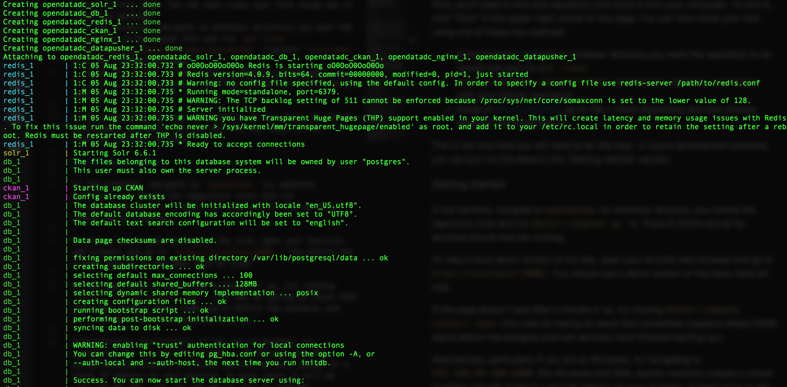
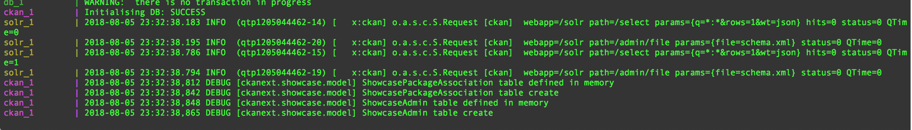
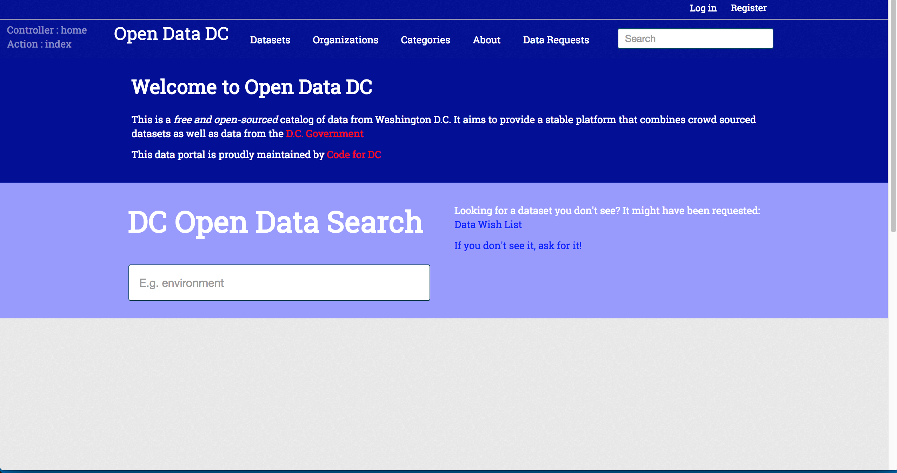
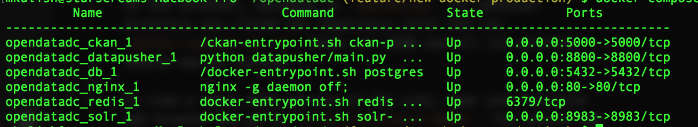
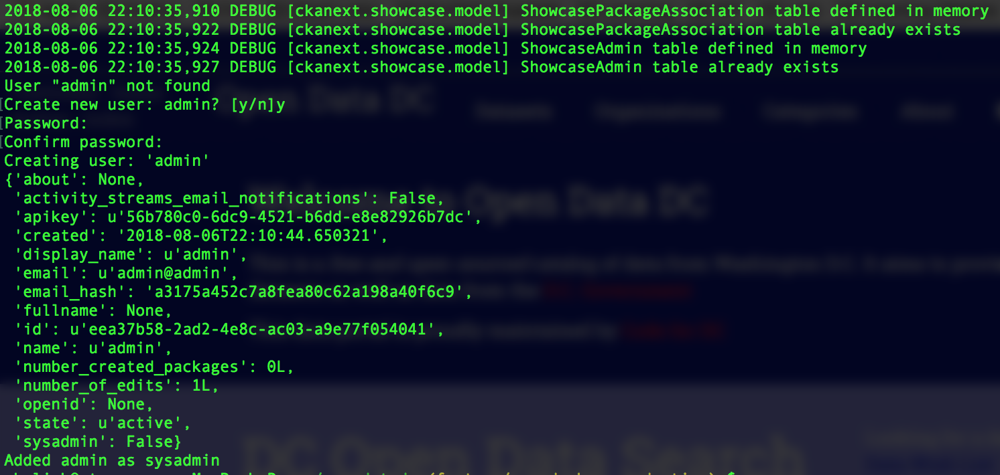

# data.codefordc.org

This repository is an open-source project for [data.codefordc.org](http://data.codefordc.org/), a [CKAN](https://ckan.org/) data portal run by [Code for DC](https://codefordc.org/).

This repository includes the CKAN theme used by data.codefordc.org as well any custom pages used by the site.

# Setup instructions

## Prerequisites

- Git
- [Docker](https://docs.docker.com/engine/installation/) for your operating system

## Cloning the repository

First, you'll need to fork this repository and clone it onto your computer. To fork it, click "Fork" in the upper-right corner of this page. You can then clone your fork using one of these two methods:
- in the terminal, navigate to whatever directory you want the repository to be cloned into and run `git clone https://github.com/<username>/opendatadc` (replace `<username>` with your GitHub username)
- inside of [GitHub Desktop](https://desktop.github.com/), go to _File > Clone Repository_ and then choose where to clone the repo to

This is the only time you will need to do this step. In future development sessions, you can just run the steps in the "Getting started" section.

# Getting started
## Quick Started
This project uses docker to speed up on boarding and make it easier to maintain.  

To start the application navigate to the directory you cloned the project to (most likely _opendatadc_) and run:
`docker-compose up` and you should see   After a few minutes you should see 

Navigate to localhost and you'll find CKAN running with the code for dc theme. It should look something like:   To stop the app run `ctrl-c`

## Up and Down
Sometimes its convenient to start the application without taking up a terminal window.  To do so, run `docker-compose up -d`; the application will now start in the background and will be avaible at `localhost` (might take a few minutes to start up).  Now run: `docker-compose ps` and you should see the running containers 

### Stopping
`docker-compose stop`

### Starting
`docker-compose start`

## Setting up Admin account
Run: `docker-compose exec ckan ckan-paster --plugin=ckan  sysadmin add admin email=admin@admin  -c /etc/ckan/default/ckan.ini`

And fill in the prompts: 

## Setting up test-data
Very basic test data can be setup; alternatively sets can be exported from the real site and uploaded to your local one.

To set up test data run: `docker-compose exec ckan ckan-paster --plugin=ckan  create-test-data  -c /etc/ckan/default/ckan.ini`

## Local development

Changes to the source HTML, JavaScript, and CSS/SCSS files will automatically show up when the browser is reloaded.

Changes to Python files will require the CKAN container to be restarted.  To do so run `docker-compose restart ckan`.

### Styles

SASS is used to create and maintain styles for the theme in order to compile the styles run
```
sass ckanext/open_data_dc/fanstatic/open_data_dc.scss ckanext/open_data_dc/fanstatic/open_data_dc.css
```

### Changing templates, files, JavaScript

Is a very large subject and the best way to get started is to read the [CKAN documents](http://docs.ckan.org/en/latest/theming/templates.html)

Feel free to contribute here or join us on [Waffle.io](https://waffle.io/codefordc/data.codefordc.org)

## Deploying a new version

1. Login to the remote production machine through ssh
2. Run `docker-compose rm ckan`
3. Run `docker-compose pull`
4. Run `docker-compose up -d`

### Re-indexing solr
This needs to get run when solr is updated
`docker-compose exec ckan ckan-paster --plugin=ckan search-index rebuild -c /etc/ckan/default/ckan.ini`

> Note: running this might require a restart via `docker-compose restart ckan`
